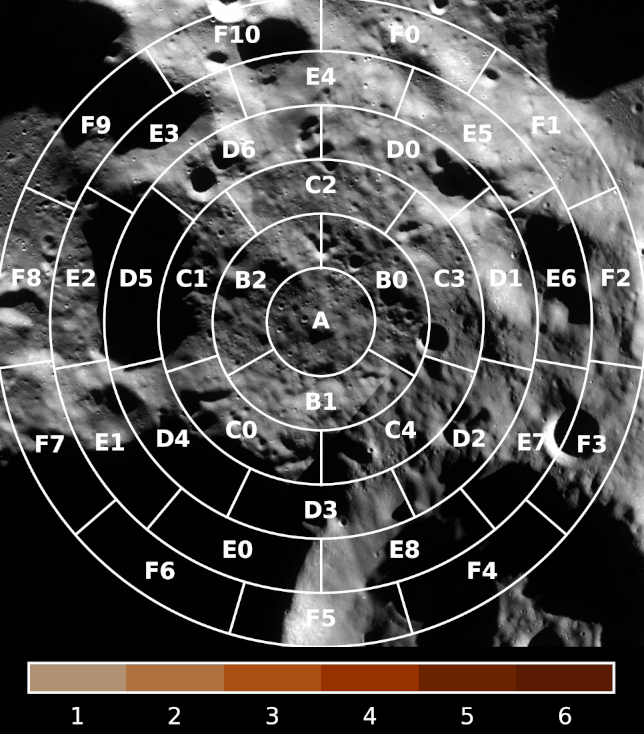

# Nosu's Discord Games

This repository contains the code of the games and activities I created for Discord servers, usually for
the [Discord server](https://discord.com/invite/WVfzEDW) of the [Space Launch Now](https://spacelaunchnow.me/)
community.

## [Re-entry bingo](https://github.com/Nosudrum/discord-games/tree/main/reentry-bingo)

This is a prediction game related to uncontrolled atmospheric re-entries of large rocket debris and spacecraft on Earth.

:warning: The Earth map background `NE1_50M_SR_W.tif` (170 MB) **required to generate these plots** can be
downloaded [here](https://www.naturalearthdata.com/http//www.naturalearthdata.com/download/50m/raster/NE1_50M_SR_W.zip).

### 2022-143B (CZ-5B core stage)

 

 

### 1995-021A (ERS 2)

 

 

### 1972-023E (Kosmos 482)

 

## [Landing bingo](https://github.com/Nosudrum/discord-games/tree/main/landing-bingo)

This is a prediction game related to an autonomous landing in a target area.
It could easily be repurposed for any kind of map-based prediction game, by changing the map background and adjusting
the grid generation parameters.

### Hakuto-R M1 (ispace)

 

### Blue Ghost M1 (Firefly)

 

### Nova-C IM-2 (Intuitive Machines)

 

