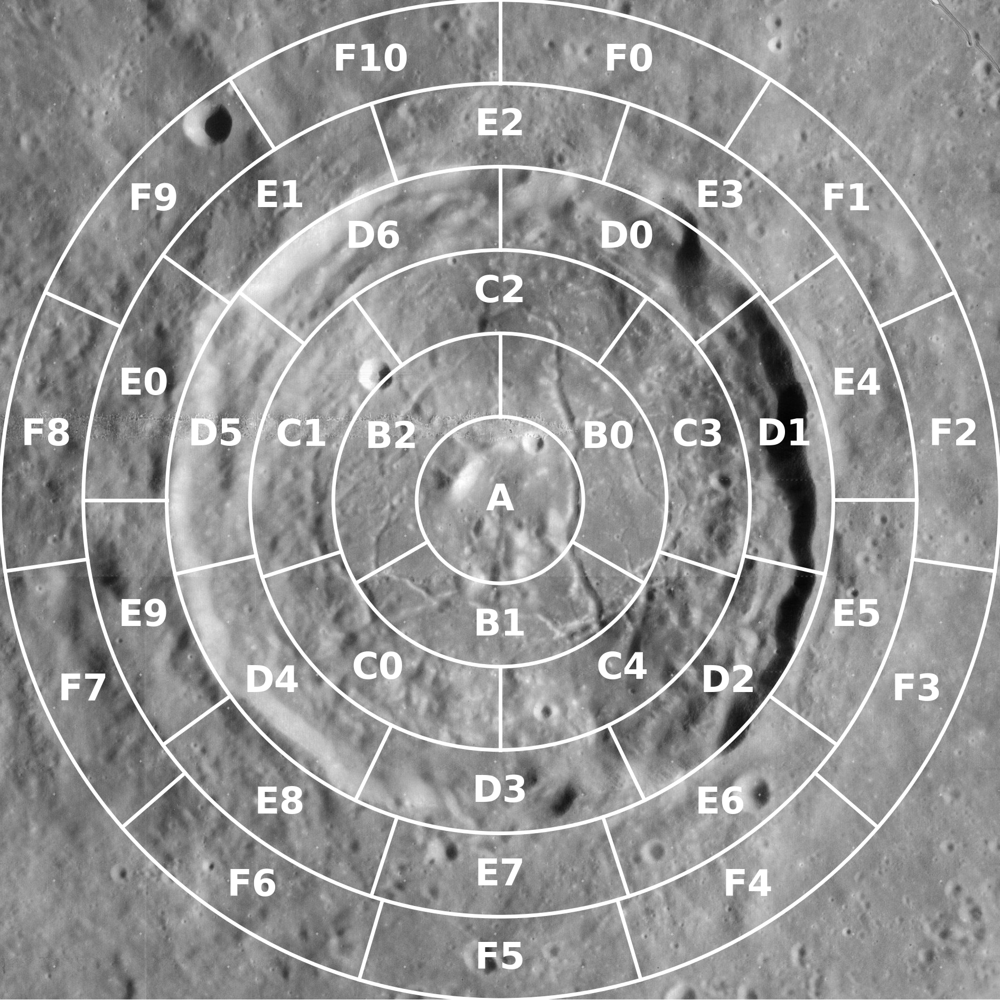
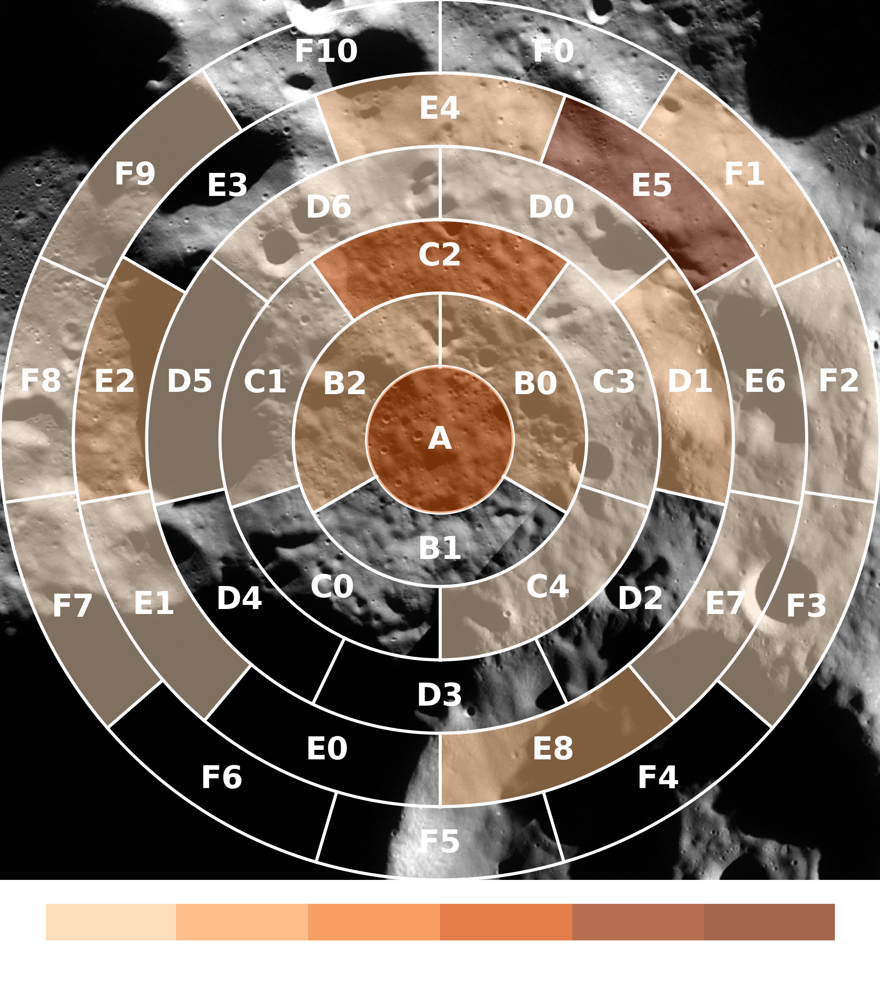

# Landing Bingo

This is a prediction game related to a landing in a lunar crater. It could
easily be repurposed for any kind of map-based prediction game, by changing the map background and adjusting the grid
generation parameters.

 

