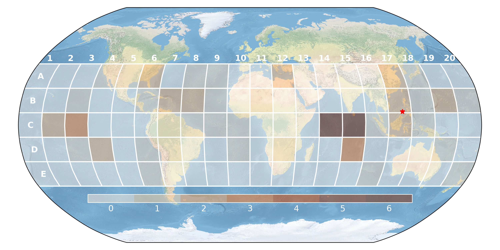

# Re-entry Bingo

This is a prediction game related to uncontrolled atmospheric re-entries of large rocket debris on Earth. It could easily be repurposed for any kind of map-based prediction game, by changing the map background and adjusting the grid generation parameters.

 

 

:warning: The Earth map background `NE1_50M_SR_W.tif` (170 MB) can be downloaded [here](https://www.naturalearthdata.com/http//www.naturalearthdata.com/download/50m/raster/NE1_50M_SR_W.zip).
