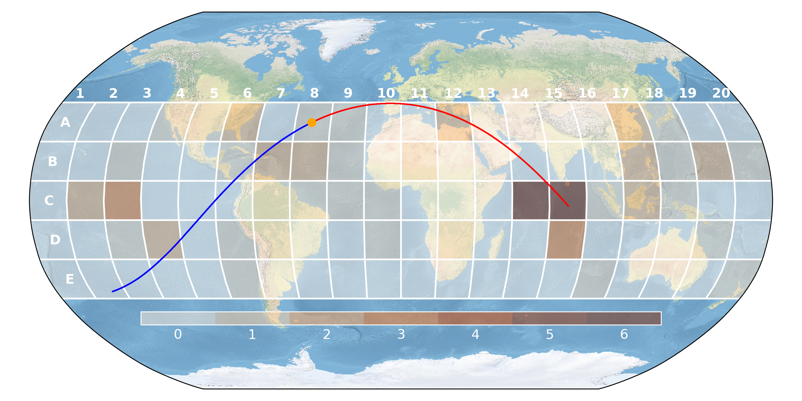

# Re-entry Bingo

This is a prediction game related to uncontrolled atmospheric re-entries of large rocket debris on Earth.
It could easily be repurposed for any kind of map-based prediction game, by changing the map background and adjusting
the grid generation parameters.

The example plots below are for the re-entry of [2022-143B](https://aerospace.org/reentries/54217), the core stage of
the CZ-5B rocket that launched Mengtian – the third module of the Chinese Space Station – on 31 October 2022.

:warning: The Earth map background `NE1_50M_SR_W.tif` (170 MB) **required to generate these plots** can be downloaded [here](https://www.naturalearthdata.com/http//www.naturalearthdata.com/download/50m/raster/NE1_50M_SR_W.zip).

 

 

